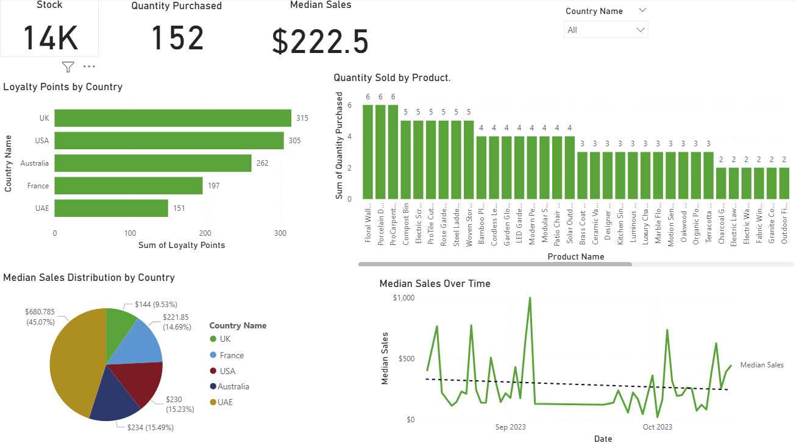
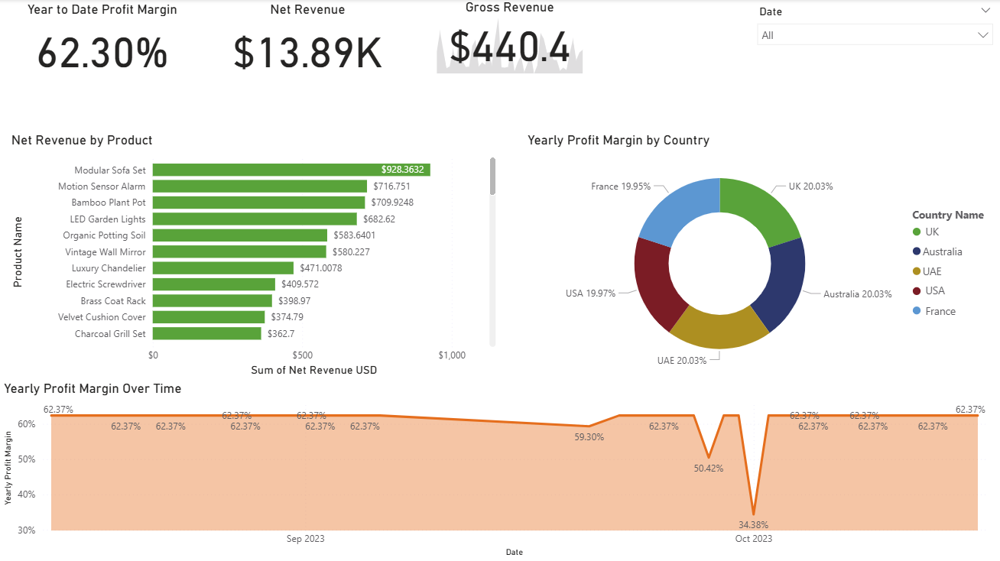

# Traders-Data-Analysis-Project
**I'm sharing an Exploratory Data Analysis (EDA) and Data Visualization of the data from Tailwind Traders in Coursera. A detailed report that outlines the company's lastest sales data. This report can shape its future sales strategies. A Data Analysis Project performed in my journey into Data Science.**

**About the Project**  
Tailwind Traders is a fictitious retail company showcasing the future of intelligent application experiences. These reference apps are all are powered by the Azure cloud, built with best-in-class tools, and made smarter through data and AI.
Tailwind Traders requires a detailed report that outlines the company’s latest sales data. The report must contain gross amounts and the difference between gross and net sales. Let’s help Tailwind Traders create this report so it can shape its future sales strategies.

My tasks in this project were to:
- Prepare Sales Excel data
- Configure data sources, design and develop the data model
- Configure aggregations using DAX
- Create sales and profit reports
- Create an executive dashboard
- Configure alerts and subscriptions

***Prerequisite***: Data Analyst Roadmap, Power BI, Python  

**Project - Traders Data Analysis**  
Datasets: [Countries]('Dataset\Countries.xlsx'), [Purchase]('Dataset\Purchases.xlsx'), [Sales]('Dataset\Tailwind-Traders-Sales.xlsx')  

**Objective**

1. Sales Overview       

2. Profit Overview  

